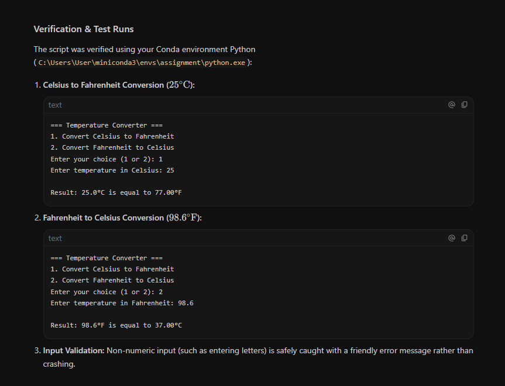

# Assignment Write-up: Temperature Converter

## 1. Coding Agent and Version

- **Coding Agent:** Google Antigravity 2.0, version 2.17.0
- **Model Used:** Gemini 3.8 Flash High

## 2. Screenshot

## 3. Exact Prompts Used

### Original Prompt:
> "Create a small Python command-line temperature converter. Ask the user whether they want to convert Celsius to Fahrenheit or Fahrenheit to Celsius, ask for the temperature, calculate the conversion, and print the result. Keep the code simple and beginner-friendly. Run the program to verify that it works."

### Environment Clarification:
Antigravity initially could not locate Python in the system PATH. The following instruction was provided to point the agent to the existing Conda environment:
> "Python 3.12.14 is already installed in my Conda environment. Use C:\Users\User\miniconda3\envs\assignment\python.exe directly to run and test the program. Do not install another Python version."

## 4. Corrections and Review

- I reviewed the final `temperature_converter.py` script line-by-line.
- The Celsius-to-Fahrenheit (`(celsius * 9 / 5) + 32`) and Fahrenheit-to-Celsius (`(fahrenheit - 32) * 5 / 9`) formulas were verified to be correct.
- Input validation (catching non-numeric inputs with a `try...except ValueError` block) and handling of invalid menu choices were reviewed.
- No manual corrections to the final Python code were necessary.
- The only intervention required was specifying the correct Python interpreter path (`C:\Users\User\miniconda3\envs\assignment\python.exe`) after the agent was unable to automatically locate Python.

## 5. What I Learned

- I was surprised that the coding agent could create the program and test different inputs by itself. I also learned that I still need to review what the agent is doing, because it could not initially find my Python environment and I had to give it the correct path. 